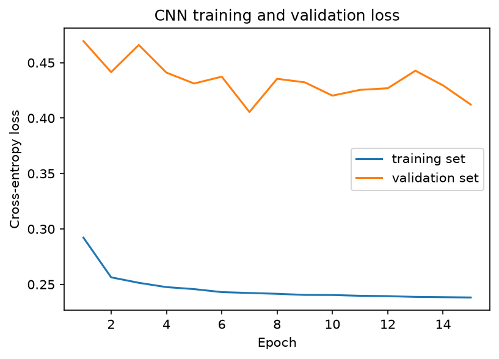
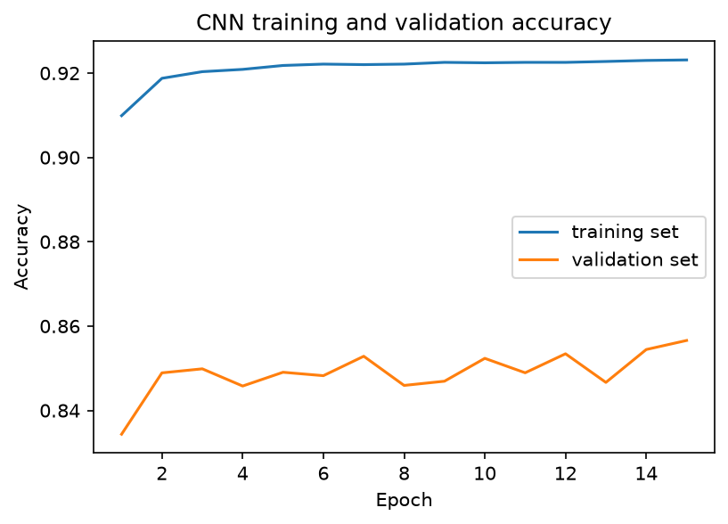
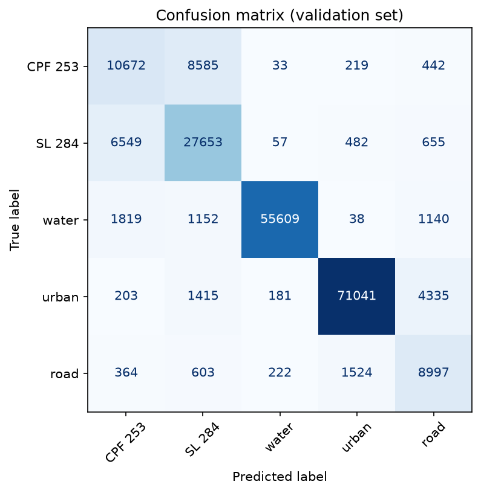
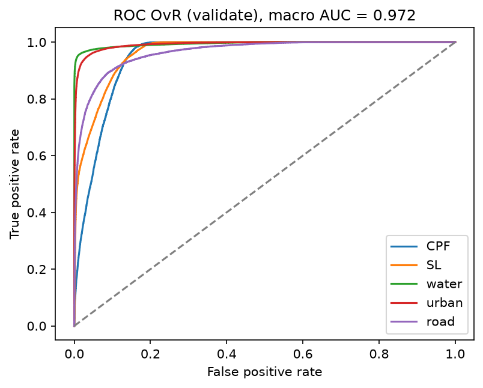
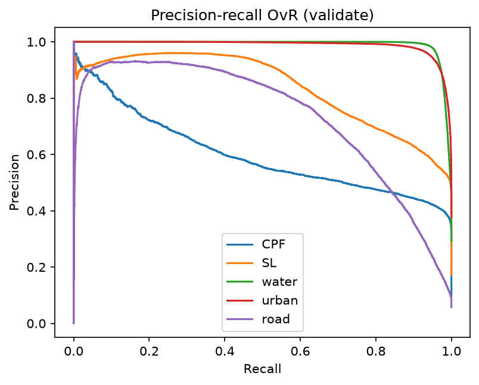
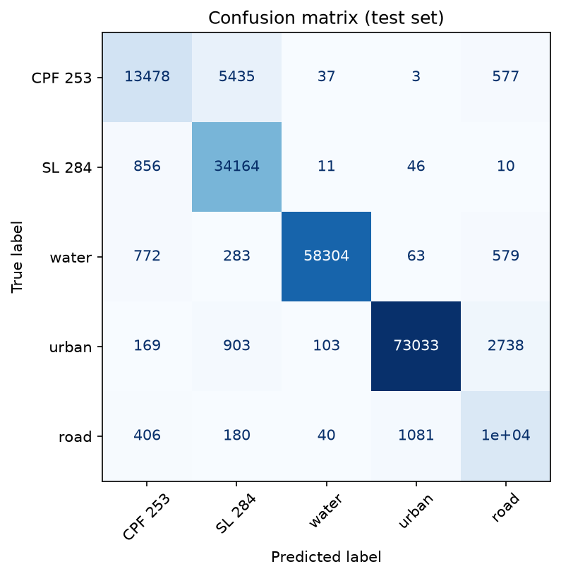
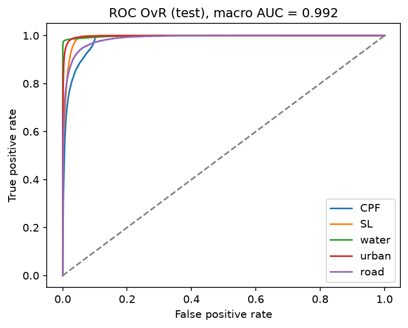
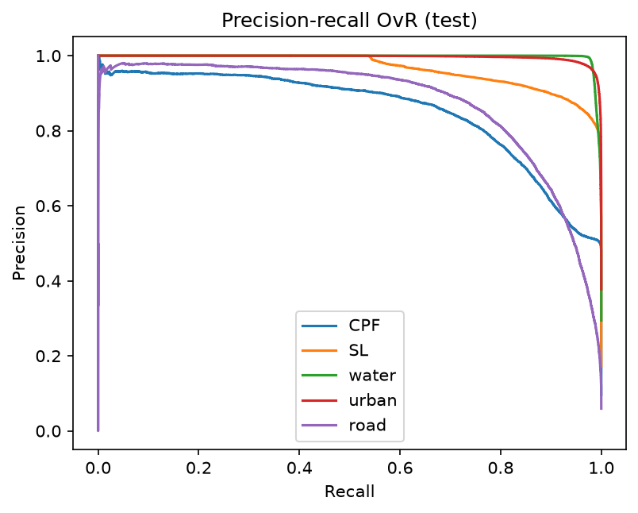
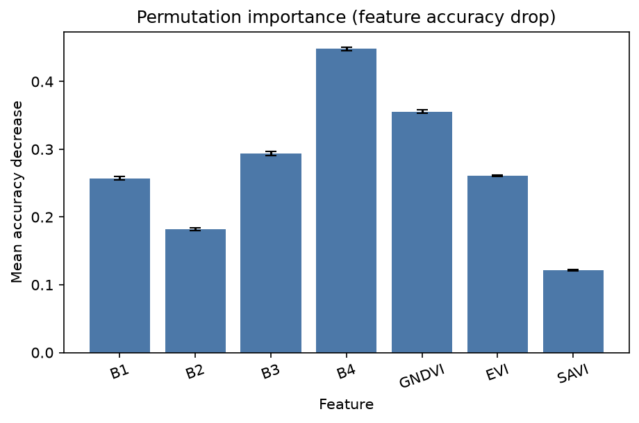

# 1D CNN: 5-class land cover (7 features)

This folder trains a **1D convolutional network** to classify five land-cover / crop classes from a 7-feature pixel spectrum.

- Classes: **CPF 253**, **SL 284**, **water**, **urban**, **road** (labels 0–4)
- Features: `B1, B2, B3, B4, GNDVI, EVI, SAVI` (lat/lon are not used)
- Split unit: whole polygons, not random pixels
- Device (this run): `cuda`
- Best checkpoint: epoch 7 (lowest validation loss = 0.4055)

The previous CPF 253-vs-SL 284 (4-band) report is kept at [`CNN_README_2class.md`](CNN_README_2class.md).

Re-run `python CNN/run_cnn.py` to train again. This file is **rewritten automatically** at the end of that script.

## Headline results

| Split | Accuracy | Balanced acc | Kappa | ROC-AUC (macro OvR) | Macro F1 | Weighted F1 |
|---|---:|---:|---:|---:|---:|---:|
| Validate | 0.8528 | 0.7871 | 0.8001 | 0.9723 | 0.7685 | 0.8574 |
| Test (once) | 0.9298 | 0.8888 | 0.9041 | 0.9920 | 0.8804 | 0.9299 |

**How to read this.** Validate is the check on unseen polygons used during training. Test is scored **once** after the best weights are locked.

## Is the model biased toward large classes?

**No.** Unequal pixel counts (urban 495,553 vs road 69,203) do **not** mean the CNN only predicts urban. Urban/water were kept in full. Bias was handled in the **loss**, not by deleting pixels.

**Problem.** A dummy that always predicts **urban** would get about **37.8%** test accuracy and **0** recall on CPF 253, SL 284, water, and road. This is **not** a dummy dataset. It is a fake always-urban guess on the **real** test pixels (76,946 / 203,690).

**Solution.** Inverse-frequency class weights `w_c = N / (5 × n_c)` in weighted cross-entropy. Road (smallest) got weight **4.009**; urban (largest) got **0.533**. CPF 253 1.944, SL 284 1.123, water 0.681. We report balanced accuracy and macro F1, not only overall accuracy.

**Evidence (this run).** Test accuracy is **0.9298** vs the 37.8% dummy. Balanced accuracy is **0.8888** (close to overall accuracy, so no collapse onto one class). Road test recall is **0.8592** and CPF 253 test recall is **0.6901** — both would be 0 if the model ignored small classes. Water/urban are strong because they are spectrally distinct, not only because they have more pixels.

| Class | Train pixels | Class weight | Val recall | Test recall |
|---|---:|---:|---:|---:|
| CPF 253 | 93,549 | 1.944 | 0.5349 | 0.6901 |
| SL 284 | 162,026 | 1.123 | 0.7812 | 0.9737 |
| water | 267,055 | 0.681 | 0.9306 | 0.9717 |
| urban | 341,432 | 0.533 | 0.9205 | 0.9491 |
| road | 45,367 | 4.009 | 0.7683 | 0.8592 |

CPF 253 is the weakest class because of **field shift** (unseen polygons), the same pattern as the 2-class run, not because urban has more pixels.

## Data used by the CNN

| Split | CPF 253 | SL 284| water | urban | road | Total | Share |
|---|---:|---:|---:|---:|---:|---:|---:|
| Train | 93,549 | 162,026 | 267,055 | 341,432 | 45,367 | 909,429 | 69.0% |
| Validate | 19,951 | 35,396 | 59,758 | 77,175 | 11,710 | 203,990 | 15.5% |
| Test | 19,530 | 35,087 | 60,001 | 76,946 | 12,126 | 203,690 | 15.5% |
| **All** | **133,030** | **232,509** | **386,814** | **495,553** | **69,203** | **1,317,109** | **100%** |

`StandardScaler` is fit on **train** pixels only, then applied to validate and test.

## Model

- Input shape (PyTorch): `(batch, 1, 7)`
- Conv1D 32, kernel 2, BatchNorm, ReLU
- Conv1D 64, kernel 2, ReLU
- Flatten → Dense 64 → Dropout 0.3 → **5-class** logits
- Loss: weighted cross-entropy
- Optimizer: Adam (`lr=1e-3`, `weight_decay=1e-4`)
- Batch size 256, max 40 epochs, early stop on validation loss (patience 8), seed 42

## How to run

```
python CNN/run_cnn.py
```

Scripts: `config.py`, `dataset.py`, `model.py`, `train.py`, `evaluate.py`, `plots.py`, `run_cnn.py`.

## Training set vs validation set

Early stop at epoch 15; **best validation loss at epoch 7**.

| Epoch | Train loss | Train acc | Val loss | Val acc |
|---:|---:|---:|---:|---:|
| 1 | 0.2921 | 0.9099 | 0.4695 | 0.8344 |
| 2 | 0.2564 | 0.9188 | 0.4415 | 0.8489 |
| 3 | 0.2514 | 0.9203 | 0.4660 | 0.8499 |
| 4 | 0.2475 | 0.9209 | 0.4410 | 0.8458 |
| 5 | 0.2457 | 0.9218 | 0.4312 | 0.8491 |
| 6 | 0.2430 | 0.9221 | 0.4374 | 0.8482 |
| 7 (best) | 0.2422 | 0.9220 | 0.4055 | 0.8528 |
| 8 | 0.2415 | 0.9221 | 0.4354 | 0.8459 |
| 9 | 0.2405 | 0.9225 | 0.4323 | 0.8469 |
| 10 | 0.2404 | 0.9224 | 0.4203 | 0.8524 |
| 11 | 0.2397 | 0.9225 | 0.4255 | 0.8489 |
| 12 | 0.2394 | 0.9225 | 0.4269 | 0.8534 |
| 13 | 0.2387 | 0.9228 | 0.4428 | 0.8466 |
| 14 | 0.2384 | 0.9230 | 0.4295 | 0.8544 |
| 15 | 0.2382 | 0.9231 | 0.4122 | 0.8566 |





## Validate

Used every epoch for early stopping. Not the final paper number.

Accuracy 0.8528. Balanced accuracy 0.7871. Cohen's kappa 0.8001. ROC-AUC 0.9723. Macro F1 0.7685. Weighted F1 0.8574.

| Class | Precision | Recall | F1-score | Support |
|---|---:|---:|---:|---:|
| CPF 253| 0.5443 | 0.5349 | 0.5396 | 19,951 |
| SL 284| 0.7017 | 0.7812 | 0.7393 | 35,396 |
| water | 0.9912 | 0.9306 | 0.9599 | 59,758 |
| urban | 0.9691 | 0.9205 | 0.9442 | 77,175 |
| road | 0.5779 | 0.7683 | 0.6596 | 11,710 |
| **Overall accuracy** |  |  | **0.8528** | **203,990** |

```
              precision    recall  f1-score   support

       CPF 253     0.5443    0.5349    0.5396     19951
       SL 284     0.7017    0.7812    0.7393     35396
       water     0.9912    0.9306    0.9599     59758
       urban     0.9691    0.9205    0.9442     77175
        road     0.5779    0.7683    0.6596     11710

    accuracy                         0.8528    203990
   macro avg     0.7568    0.7871    0.7685    203990
weighted avg     0.8652    0.8528    0.8574    203990
```

|  | Pred CPF 253 | Pred SL 284 | Pred water | Pred urban | Pred road |
|---|---:|---:|---:|---:|---:|
| Actual CPF 253 | 10,672 | 8,585 | 33 | 219 | 442 |
| Actual SL 284 | 6,549 | 27,653 | 57 | 482 | 655 |
| Actual water | 1,819 | 1,152 | 55,609 | 38 | 1,140 |
| Actual urban | 203 | 1,415 | 181 | 71,041 | 4,335 |
| Actual road | 364 | 603 | 222 | 1,524 | 8,997 |







## Test (scored once)

Held-out polygons. Scored after training finished.

Accuracy 0.9298. Balanced accuracy 0.8888. Cohen's kappa 0.9041. ROC-AUC 0.9920. Macro F1 0.8804. Weighted F1 0.9299.

| Class | Precision | Recall | F1-score | Support |
|---|---:|---:|---:|---:|
| CPF 253 | 0.8595 | 0.6901 | 0.7656 | 19,530 |
| SL 284 | 0.8340 | 0.9737 | 0.8984 | 35,087 |
| water | 0.9967 | 0.9717 | 0.9841 | 60,001 |
| urban | 0.9839 | 0.9491 | 0.9662 | 76,946 |
| road | 0.7274 | 0.8592 | 0.7879 | 12,126 |
| **Overall accuracy** |  |  | **0.9298** | **203,690** |

```
              precision    recall  f1-score   support

         CPF 253     0.8595    0.6901    0.7656     19530
          SL 284     0.8340    0.9737    0.8984     35087
       water     0.9967    0.9717    0.9841     60001
       urban     0.9839    0.9491    0.9662     76946
        road     0.7274    0.8592    0.7879     12126

    accuracy                         0.9298    203690
   macro avg     0.8803    0.8888    0.8804    203690
weighted avg     0.9347    0.9298    0.9299    203690
```

|  | Pred CPF 253 | Pred SL 284 | Pred water | Pred urban | Pred road |
|---|---:|---:|---:|---:|---:|
| Actual CPF 253 | 13,478 | 5,435 | 37 | 3 | 577 |
| Actual SL 284 | 856 | 34,164 | 11 | 46 | 10 |
| Actual water | 772 | 283 | 58,304 | 63 | 579 |
| Actual urban | 169 | 903 | 103 | 73,033 | 2,738 |
| Actual road | 406 | 180 | 40 | 1,081 | 10,419 |







## Permutation importance

Each feature is shuffled on 20,000 validation pixels (7 features × 10 repeats). Larger drop = the model used that feature more. **B4** is the strongest in this run.

| Feature | Mean accuracy drop | Std |
|---|---:|---:|
| B4 | 0.4481 | 0.0030 |
| GNDVI | 0.3557 | 0.0029 |
| B3 | 0.2940 | 0.0031 |
| EVI | 0.2612 | 0.0009 |
| B1 | 0.2571 | 0.0024 |
| B2 | 0.1823 | 0.0020 |
| SAVI | 0.1213 | 0.0010 |



## Files written by a run

| Path | What |
|---|---|
| `results/best_model.pt` | Weights at best validation loss |
| `results/metrics.json` | All numeric metrics |
| `results/loss_curve.png` | Train vs validate loss |
| `results/accuracy_curve.png` | Train vs validate accuracy |
| `results/confusion_matrix_validate.png` | Validate 5×5 confusion matrix |
| `results/confusion_matrix_test.png` | Test 5×5 confusion matrix |
| `results/roc_validate.png` / `results/roc_test.png` | OvR ROC |
| `results/pr_validate.png` / `results/pr_test.png` | OvR precision-recall |
| `results/permutation_importance.png` | Feature importance |
| `CNN_README.md` | This 5-class report (auto-updated) |
| `CNN_README_2class.md` | Archived CPF 253 vs SL 284 results |
