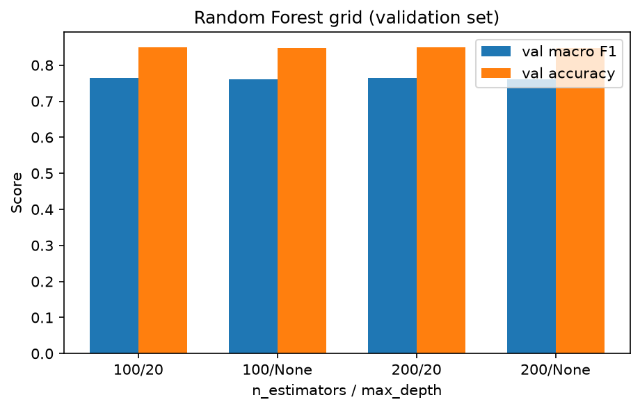
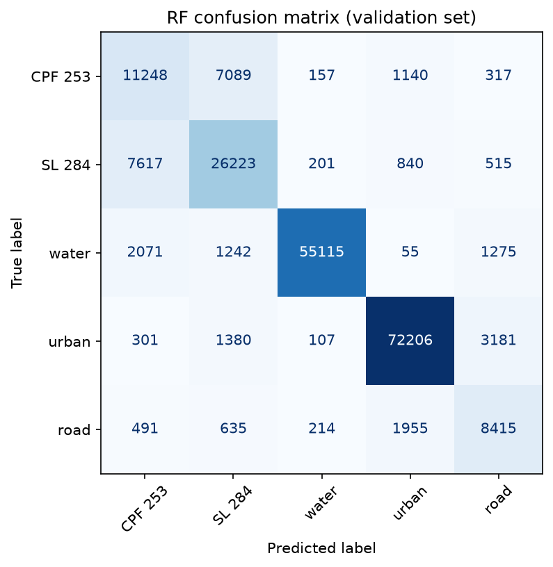
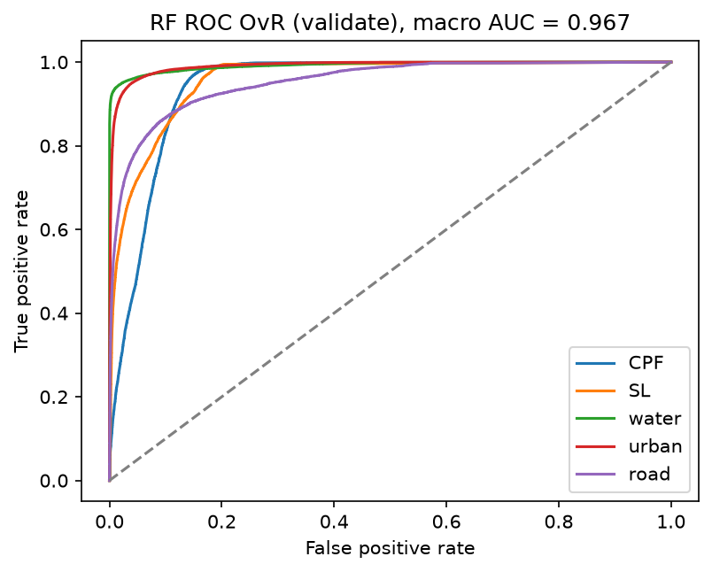
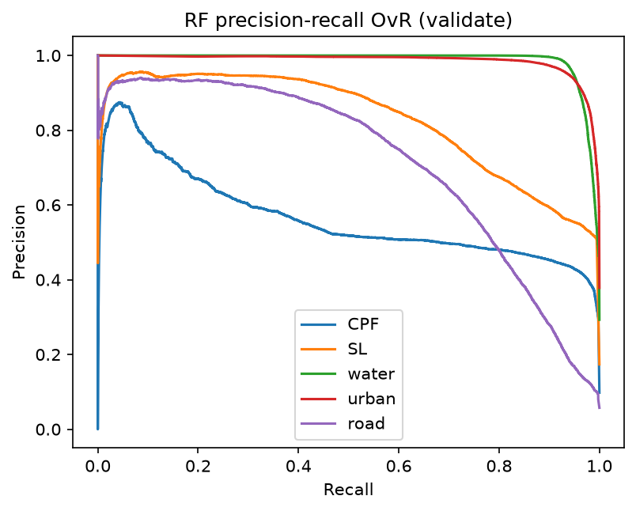
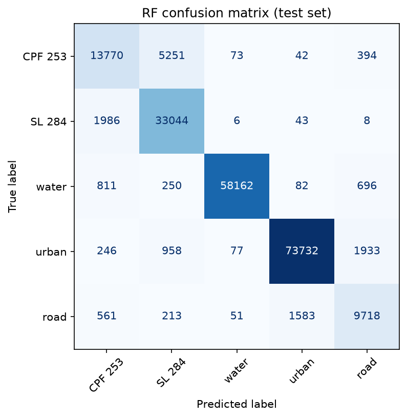
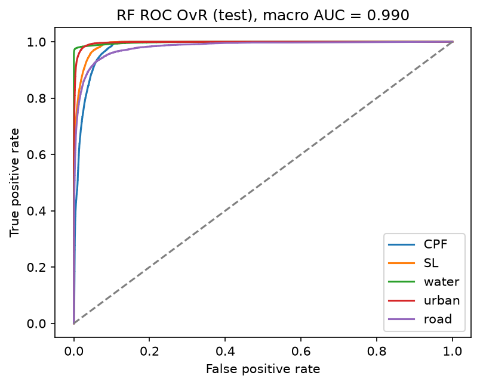
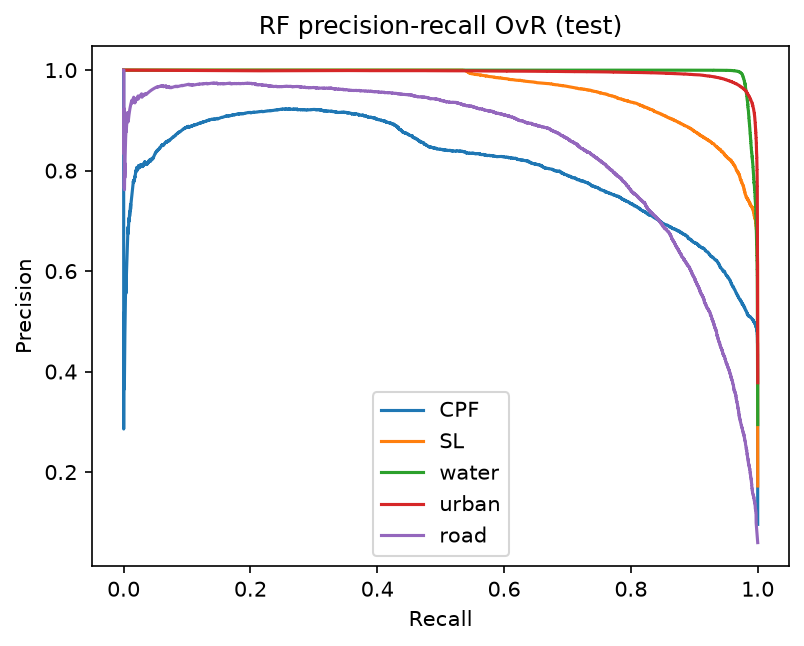
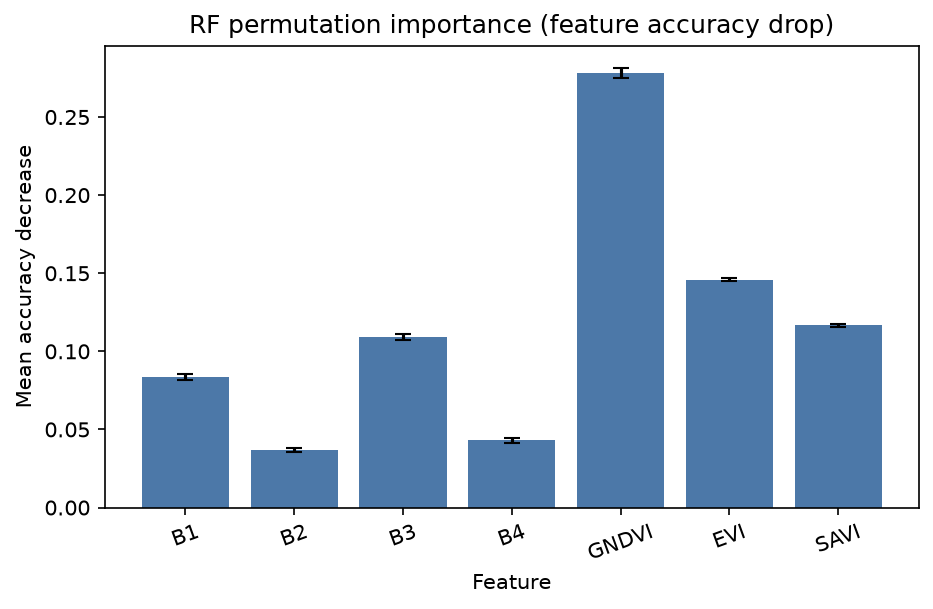
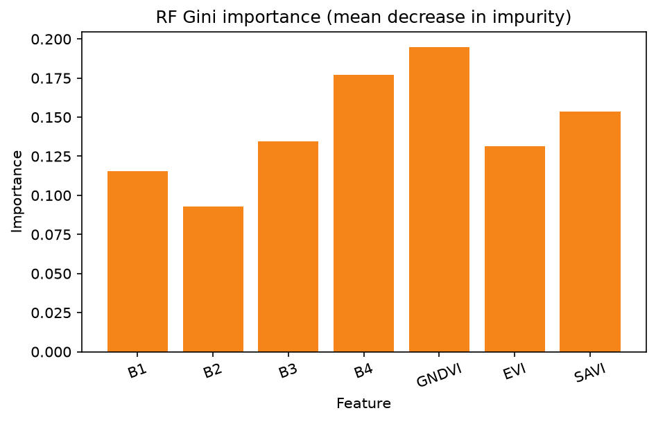

# Random Forest: 5-class land cover (7 features)

Random Forest on the same polygon splits as the CNN and Linear SVM.

- Classes: **CPF 253**, **SL 284**, **water**, **urban**, **road**
- Features: `B1, B2, B3, B4, GNDVI, EVI, SAVI` (no lat/lon)
- Split unit: whole polygons
- `class_weight="balanced"` — urban/water were **not** downsampled; the RF is **not** biased toward large classes
- Grid on **validate** only: `n_estimators` in `{100, 200}`, `max_depth` in `{20, None}`. Best = **200 trees, depth 20** (val macro F1 0.7653)
- Test scored **once**

Re-run `python RANDOM_FOREST/run_rf.py`. This file is rewritten at the end of that script.

## Why Random Forest

Linear SVM draws one straight split in 7-D. RF can mix bands (for example high GNDVI and low red). That is the point of this third model. Same full pixels. Same class weights. Still not biased by class size.

## Headline results

| Split | Accuracy | Balanced acc | Kappa | ROC-AUC (macro OvR) | Macro F1 | Weighted F1 |
|---|---:|---:|---:|---:|---:|---:|
| Validate | 0.8491 | 0.7762 | 0.7942 | 0.9675 | 0.7653 | 0.8529 |
| Test (once) | 0.9251 | 0.8752 | 0.8974 | 0.9902 | 0.8723 | 0.9252 |

## Is the model biased toward large classes?

**No.** Classes have very different pixel counts (urban **495,553**, road **69,203**, about 7.5:1). That does **not** mean the RF only predicts urban. Large classes were kept in full. Bias is handled with `class_weight="balanced"` (inverse frequency), the same idea as the CNN and SVM.

**Problem.** A dummy that always predicts **urban** would get about **37.8%** test accuracy and **0** recall on CPF 253, SL 284, water, and road. This is **not** a dummy dataset. It is a fake always-urban guess on the **real** test pixels (76,946 / 203,690). If the RF ignored small classes, overall accuracy could still look high because urban + water are ~67% of pixels.

**Solution.** `RandomForestClassifier(..., class_weight="balanced")`. sklearn sets weight `N / (5 × n_c)` so road (smallest) is up-weighted (**4.009**) and urban (largest) is down-weighted (**0.533**). We report balanced accuracy and macro F1, not only overall accuracy. We did **not** downsample urban/water.

**Evidence (this run).** Test accuracy is **0.9251** vs the 37.8% dummy. Balanced accuracy is **0.8752** (not collapsed onto one class). Road test recall is **0.8014** and CPF 253 test recall is **0.7051** — both would be 0 if the model ignored small classes. Water/urban are strong because they are spectrally distinct, not only because they have more pixels.

| Class | Train pixels | Weight `N/(5 n_c)` | Val recall | Test recall |
|---|---:|---:|---:|---:|
| CPF 253 | 93,549 | 1.944 | 0.5638 | 0.7051 |
| SL 284 | 162,026 | 1.123 | 0.7408 | 0.9418 |
| water | 267,055 | 0.681 | 0.9223 | 0.9694 |
| urban | 341,432 | 0.533 | 0.9356 | 0.9582 |
| road | 45,367 | 4.009 | 0.7186 | 0.8014 |

## Data

| Split | CPF 253 | SL 284 | water | urban | road | Total | Share |
|---|---:|---:|---:|---:|---:|---:|---:|
| Train | 93,549 | 162,026 | 267,055 | 341,432 | 45,367 | 909,429 | 69.0% |
| Validate | 19,951 | 35,396 | 59,758 | 77,175 | 11,710 | 203,990 | 15.5% |
| Test | 19,530 | 35,087 | 60,001 | 76,946 | 12,126 | 203,690 | 15.5% |
| **All** | **133,030** | **232,509** | **386,814** | **495,553** | **69,203** | **1,317,109** | **100%** |

`StandardScaler` is fit on **train** only.

## Model

- `sklearn.ensemble.RandomForestClassifier`
- `class_weight="balanced"`, `n_jobs=-1`, seed 42
- Grid on validate (best by macro F1):

| n_estimators | max_depth | Val macro F1 | Val acc |
|---:|---:|---:|---:|
| 100 | 20 | 0.7649 | 0.8489 |
| 100 | None | 0.7601 | 0.8484 |
| 200 | 20 (best) | 0.7653 | 0.8491 |
| 200 | None | 0.7603 | 0.8485 |



ROC uses `predict_proba`.

## How to run

```
python RANDOM_FOREST/run_rf.py
```

## Validate

Accuracy 0.8491. Balanced accuracy 0.7762. Kappa 0.7942. ROC-AUC 0.9675. Macro F1 0.7653. Weighted F1 0.8529.

| Class | Precision | Recall | F1-score | Support |
|---|---:|---:|---:|---:|
| CPF 253 | 0.5177 | 0.5638 | 0.5397 | 19,951 |
| SL 284 | 0.7171 | 0.7408 | 0.7288 | 35,396 |
| water | 0.9878 | 0.9223 | 0.9539 | 59,758 |
| urban | 0.9476 | 0.9356 | 0.9416 | 77,175 |
| road | 0.6141 | 0.7186 | 0.6623 | 11,710 |
| **Overall accuracy** |  |  | **0.8491** | **203,990** |

```
              precision    recall  f1-score   support

         CPF 253     0.5177    0.5638    0.5397     19951
          SL 284     0.7171    0.7408    0.7288     35396
       water     0.9878    0.9223    0.9539     59758
       urban     0.9476    0.9356    0.9416     77175
        road     0.6141    0.7186    0.6623     11710

    accuracy                         0.8491    203990
   macro avg     0.7569    0.7762    0.7653    203990
weighted avg     0.8582    0.8491    0.8529    203990
```

|  | Pred CPF 253 | Pred SL 284 | Pred water | Pred urban | Pred road |
|---|---:|---:|---:|---:|---:|
| Actual CPF 253 | 11,248 | 7,089 | 157 | 1,140 | 317 |
| Actual SL 284 | 7,617 | 26,223 | 201 | 840 | 515 |
| Actual water | 2,071 | 1,242 | 55,115 | 55 | 1,275 |
| Actual urban | 301 | 1,380 | 107 | 72,206 | 3,181 |
| Actual road | 491 | 635 | 214 | 1,955 | 8,415 |







## Test (scored once)

Accuracy 0.9251. Balanced accuracy 0.8752. Kappa 0.8974. ROC-AUC 0.9902. Macro F1 0.8723. Weighted F1 0.9252.

| Class | Precision | Recall | F1-score | Support |
|---|---:|---:|---:|---:|
| CPF 253 | 0.7926 | 0.7051 | 0.7463 | 19,530 |
| SL 284 | 0.8320 | 0.9418 | 0.8835 | 35,087 |
| water | 0.9965 | 0.9694 | 0.9827 | 60,001 |
| urban | 0.9768 | 0.9582 | 0.9674 | 76,946 |
| road | 0.7623 | 0.8014 | 0.7813 | 12,126 |
| **Overall accuracy** |  |  | **0.9251** | **203,690** |

```
              precision    recall  f1-score   support

         CPF 253     0.7926    0.7051    0.7463     19530
          SL 284     0.8320    0.9418    0.8835     35087
       water     0.9965    0.9694    0.9827     60001
       urban     0.9768    0.9582    0.9674     76946
        road     0.7623    0.8014    0.7813     12126

    accuracy                         0.9251    203690
   macro avg     0.8720    0.8752    0.8723    203690
weighted avg     0.9272    0.9251    0.9252    203690
```

|  | Pred CPF 253 | Pred SL 284 | Pred water | Pred urban | Pred road |
|---|---:|---:|---:|---:|---:|
| Actual CPF 253 | 13,770 | 5,251 | 73 | 42 | 394 |
| Actual SL 284 | 1,986 | 33,044 | 6 | 43 | 8 |
| Actual water | 811 | 250 | 58,162 | 82 | 696 |
| Actual urban | 246 | 958 | 77 | 73,732 | 1,933 |
| Actual road | 561 | 213 | 51 | 1,583 | 9,718 |







## Permutation importance

Each feature shuffled on 20,000 validation pixels (10 repeats). **GNDVI** is strongest this run.

| Feature | Mean accuracy drop | Std |
|---|---:|---:|
| GNDVI | 0.2784 | 0.0033 |
| EVI | 0.1459 | 0.0008 |
| SAVI | 0.1166 | 0.0009 |
| B3 | 0.1092 | 0.0018 |
| B1 | 0.0838 | 0.0019 |
| B4 | 0.0431 | 0.0016 |
| B2 | 0.0370 | 0.0011 |



## Gini importance

Built-in mean decrease in impurity. **GNDVI** is strongest this run.

| Feature | Gini importance |
|---|---:|
| GNDVI | 0.1950 |
| B4 | 0.1769 |
| SAVI | 0.1535 |
| B3 | 0.1345 |
| EVI | 0.1316 |
| B1 | 0.1156 |
| B2 | 0.0930 |



## Files

| Path | What |
|---|---|
| `results/best_model.joblib` | Fitted Random Forest + scaler |
| `results/metrics.json` | Numeric metrics |
| `results/grid.png` | Trees / depth vs validate scores |
| `results/confusion_matrix_*.png` | 5×5 confusion matrices |
| `results/roc_*.png` / `results/pr_*.png` | OvR curves |
| `results/permutation_importance.png` | Permutation importance |
| `results/gini_importance.png` | Gini importance |
| `RF_README.md` | This report |
