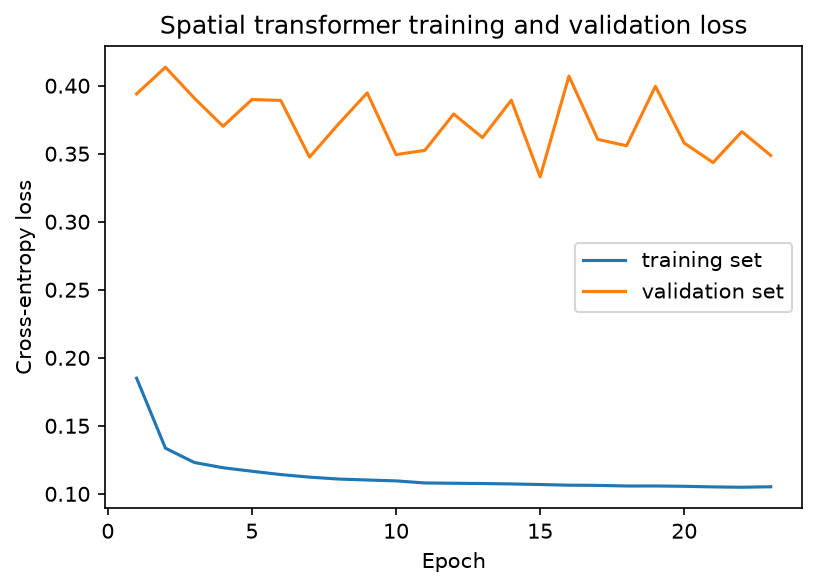
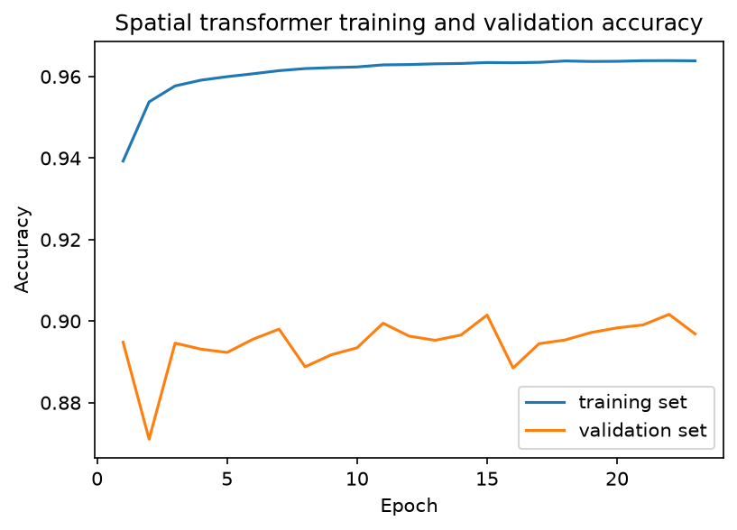
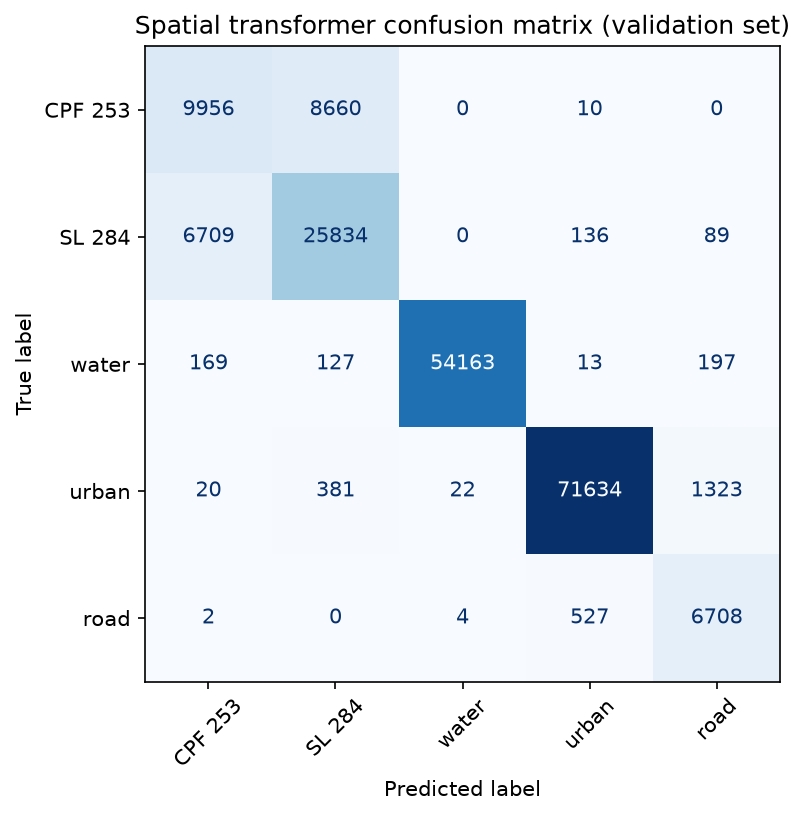
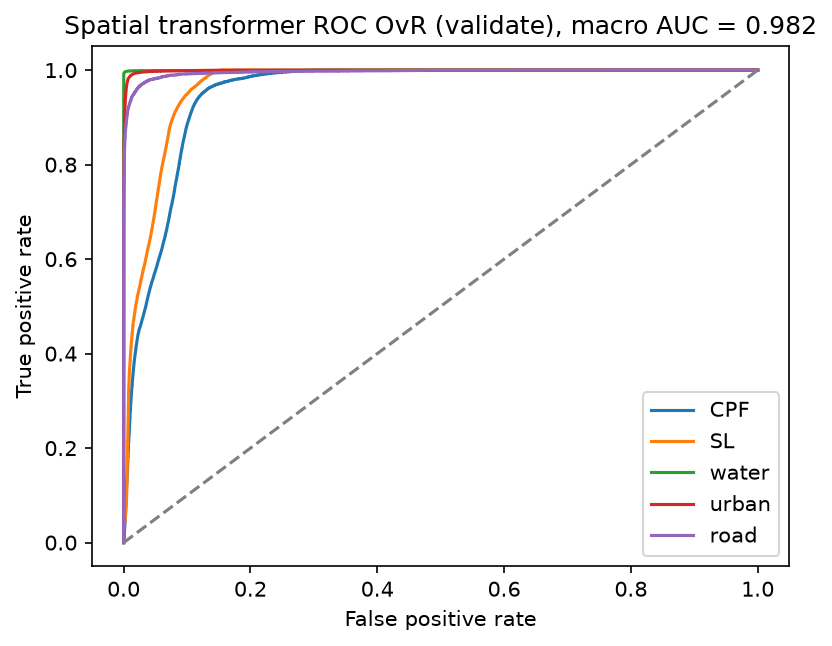
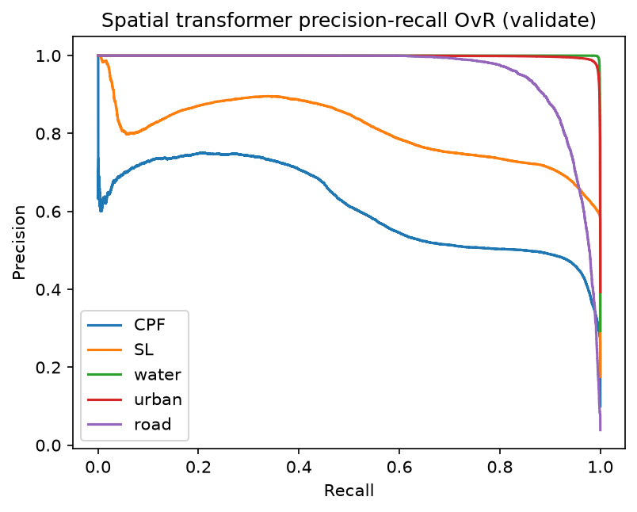
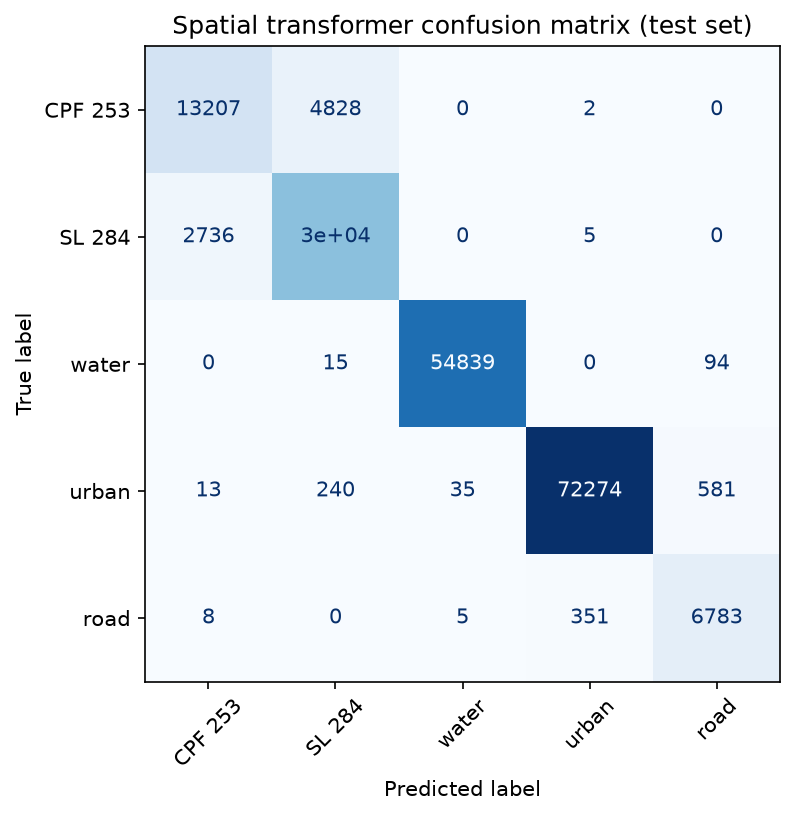
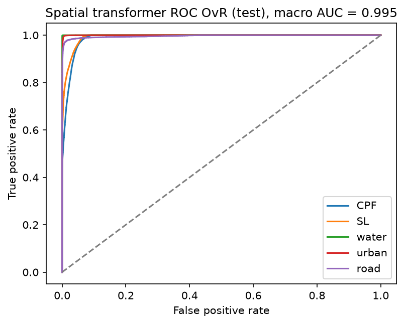
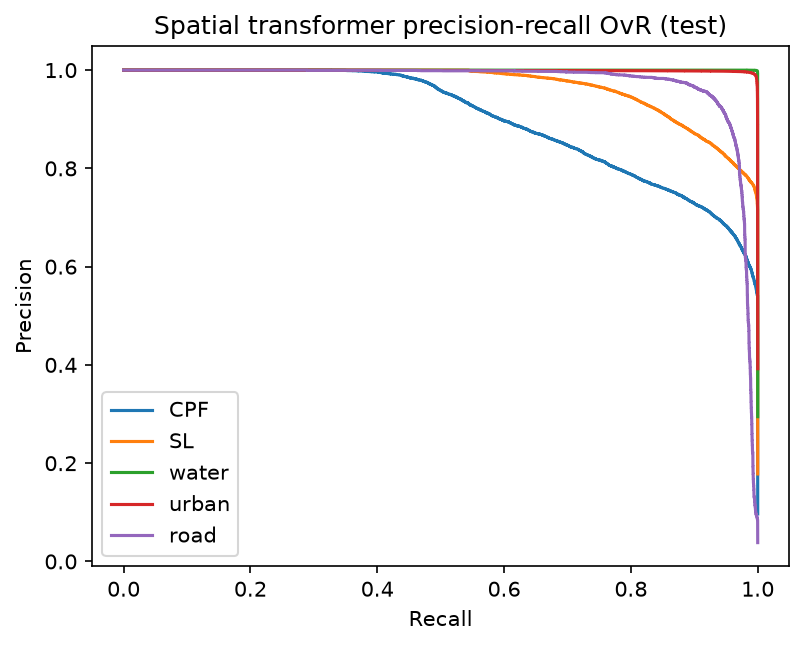
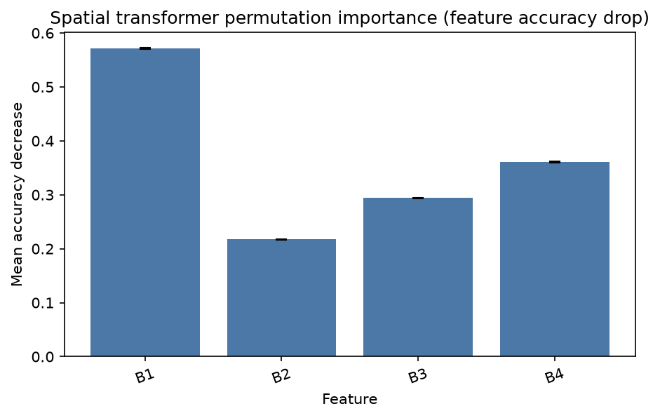

# Spatial-context Transformer: 5-class land cover (3×3, 4 features)

Polygon-based 3×3 neighbor transformer (the paper spatial method), on the same splits as CNN / SVM / RF / FT-Transformer.

- Classes: **CPF 253**, **SL 284**, **water**, **urban**, **road**
- Each sample is a **3×3 patch**: 9 pixels × 4 features (`B1, B2, B3, B4`)
- Split unit: **whole polygons**. The 3×3 window is built **inside each polygon CSV**
- Inverse-frequency class weights — urban/water were **not** downsampled
- Device (this run): `cuda`
- Best checkpoint: epoch 15 (lowest validation loss = 0.3330)
- Test scored **once**

Re-run `python SPATIAL_TFRM/run_spatial.py`. This file is rewritten at the end of that script.

## Why this model

Pixel models see one spectrum. This one sees the **3×3 patch**. The transformer mixes the center pixel with its neighbors. That is the proposed spatial method. Polygon split still blocks field leak.

## Headline results

| Split | Accuracy | Balanced acc | Kappa | ROC-AUC (macro OvR) | Macro F1 | Weighted F1 |
|---|---:|---:|---:|---:|---:|---:|
| Validate | 0.9015 | 0.8433 | 0.8630 | 0.9825 | 0.8329 | 0.9012 |
| Test (once) | 0.9522 | 0.9170 | 0.9333 | 0.9954 | 0.9164 | 0.9517 |

## Is the model biased toward large classes?

**No.** Large classes were kept in full (only polygon-edge pixels without a full 3×3 are dropped). Bias is handled in the **loss** with inverse-frequency weights.

**Problem.** A dummy that always predicts **urban** would get about **39.2%** test accuracy and **0** recall on the other classes. This is **not** a dummy dataset. It is a fake always-urban guess on the **real** test pixels after the 3×3 filter (73,143 / 186,474).

**Solution.** Weighted cross-entropy with `w_c = N / (5 × n_c)` on remaining train pixels. Road is up-weighted (**5.776**); urban is down-weighted (**0.514**). We did **not** downsample urban/water.

**Evidence (this run).** Test accuracy is **0.9522** vs the 39.2% dummy. Balanced accuracy is **0.9170**. Road test recall is **0.9491** and CPF 253 test recall is **0.7322**.

| Class | Train pixels (kept) | Weight `N/(5 n_c)` | Val recall | Test recall |
|---|---:|---:|---:|---:|
| CPF 253 | 85,472 | 1.951 | 0.5345 | 0.7322 |
| SL 284 | 151,453 | 1.101 | 0.7884 | 0.9174 |
| water | 243,338 | 0.685 | 0.9907 | 0.9980 |
| urban | 324,472 | 0.514 | 0.9762 | 0.9881 |
| road | 28,864 | 5.776 | 0.9264 | 0.9491 |

Class weights this run: CPF 253 1.951, SL 284 1.101, water 0.685, urban 0.514, road 5.776.

## Data (after 3×3 filter)

Pixels without eight neighbors **inside the same polygon** are dropped (field edges). Road loses the most because roads are thin.

| Class | Raw pixels | Kept (full 3×3) | Dropped (edges) | Kept % |
|---|---:|---:|---:|---:|
| CPF 253 | 133,030 | 122,135 | 10,895 | 91.8% |
| SL 284 | 232,509 | 217,420 | 15,089 | 93.5% |
| water | 386,814 | 352,955 | 33,859 | 91.2% |
| urban | 495,553 | 470,995 | 24,558 | 95.0% |
| road | 69,203 | 43,252 | 25,951 | 62.5% |
| **All** | **1,317,109** | **1,206,757** | **110,352** | **91.6%** |

Kept pixels by split:

| Split | CPF 253 | SL 284 | water | urban | road | Total | Share |
|---|---:|---:|---:|---:|---:|---:|---:|
| Train | 85,472 | 151,453 | 243,338 | 324,472 | 28,864 | 833,599 | 69.1% |
| Validate | 18,626 | 32,768 | 54,669 | 73,380 | 7,241 | 186,684 | 15.5% |
| Test | 18,037 | 33,199 | 54,948 | 73,143 | 7,147 | 186,474 | 15.5% |
| **All** | **122,135** | **217,420** | **352,955** | **470,995** | **43,252** | **1,206,757** | **100%** |

`StandardScaler` is fit on **train center** pixels only, then applied to all 9 positions.

## Model

One sample is **`(9, 4)`**. Batch shape is **`(batch, 9, 4)`**.

- 9 spatial tokens (3×3). Features per token: `B1, B2, B3, B4`
- Linear embed 4 → 64. **No** positional encoding
- Centre pixel is token index 4. It is **not** treated differently from the eight neighbours
- Transformer encoder: 1 layer, `d_model=64`, 4 heads, FFN 64, dropout 0.3
- Class score: **mean** of the 9 tokens, then Linear 64 → 5. No CLS token and no centre-only head
- Loss: weighted cross-entropy
- Optimizer: Adam (`lr=1e-3`, `weight_decay=1e-4`)
- Batch size 256, max 40 epochs, early stop on validation loss (patience 8), seed 42

## How to run

```
python SPATIAL_TFRM/run_spatial.py
```

## Training set vs validation set

Early stop at epoch 23; **best validation loss at epoch 15**.

| Epoch | Train loss | Train acc | Val loss | Val acc |
|---:|---:|---:|---:|---:|
| 1 | 0.1850 | 0.9393 | 0.3940 | 0.8948 |
| 2 | 0.1336 | 0.9538 | 0.4136 | 0.8710 |
| 3 | 0.1231 | 0.9577 | 0.3909 | 0.8946 |
| 4 | 0.1192 | 0.9591 | 0.3702 | 0.8931 |
| 5 | 0.1166 | 0.9600 | 0.3898 | 0.8923 |
| 6 | 0.1142 | 0.9607 | 0.3892 | 0.8956 |
| 7 | 0.1123 | 0.9614 | 0.3475 | 0.8980 |
| 8 | 0.1109 | 0.9620 | 0.3717 | 0.8888 |
| 9 | 0.1102 | 0.9622 | 0.3947 | 0.8917 |
| 10 | 0.1095 | 0.9624 | 0.3493 | 0.8935 |
| 11 | 0.1080 | 0.9629 | 0.3525 | 0.8995 |
| 12 | 0.1078 | 0.9629 | 0.3792 | 0.8963 |
| 13 | 0.1076 | 0.9631 | 0.3618 | 0.8953 |
| 14 | 0.1073 | 0.9632 | 0.3893 | 0.8966 |
| 15 (best) | 0.1069 | 0.9634 | 0.3330 | 0.9015 |
| 16 | 0.1064 | 0.9634 | 0.4070 | 0.8885 |
| 17 | 0.1062 | 0.9635 | 0.3605 | 0.8945 |
| 18 | 0.1058 | 0.9638 | 0.3559 | 0.8954 |
| 19 | 0.1058 | 0.9637 | 0.3995 | 0.8972 |
| 20 | 0.1056 | 0.9637 | 0.3578 | 0.8984 |
| 21 | 0.1051 | 0.9639 | 0.3435 | 0.8991 |
| 22 | 0.1049 | 0.9639 | 0.3662 | 0.9017 |
| 23 | 0.1052 | 0.9639 | 0.3487 | 0.8969 |





## Validate

Accuracy 0.9015. Balanced accuracy 0.8433. Kappa 0.8630. ROC-AUC 0.9825. Macro F1 0.8329. Weighted F1 0.9012.

| Class | Precision | Recall | F1-score | Support |
|---|---:|---:|---:|---:|
| CPF 253 | 0.5907 | 0.5345 | 0.5612 | 18,626 |
| SL 284 | 0.7381 | 0.7884 | 0.7624 | 32,768 |
| water | 0.9995 | 0.9907 | 0.9951 | 54,669 |
| urban | 0.9905 | 0.9762 | 0.9833 | 73,380 |
| road | 0.8065 | 0.9264 | 0.8623 | 7,241 |
| **Overall accuracy** |  |  | **0.9015** | **186,684** |

```
              precision    recall  f1-score   support

         CPF 253     0.5907    0.5345    0.5612     18626
          SL 284     0.7381    0.7884    0.7624     32768
       water     0.9995    0.9907    0.9951     54669
       urban     0.9905    0.9762    0.9833     73380
        road     0.8065    0.9264    0.8623      7241

    accuracy                         0.9015    186684
   macro avg     0.8251    0.8433    0.8329    186684
weighted avg     0.9018    0.9015    0.9012    186684
```

|  | Pred CPF 253 | Pred SL 284 | Pred water | Pred urban | Pred road |
|---|---:|---:|---:|---:|---:|
| Actual CPF 253 | 9,956 | 8,660 | 0 | 10 | 0 |
| Actual SL 284 | 6,709 | 25,834 | 0 | 136 | 89 |
| Actual water | 169 | 127 | 54,163 | 13 | 197 |
| Actual urban | 20 | 381 | 22 | 71,634 | 1,323 |
| Actual road | 2 | 0 | 4 | 527 | 6,708 |







## Test (scored once)

Accuracy 0.9522. Balanced accuracy 0.9170. Kappa 0.9333. ROC-AUC 0.9954. Macro F1 0.9164. Weighted F1 0.9517.

| Class | Precision | Recall | F1-score | Support |
|---|---:|---:|---:|---:|
| CPF 253 | 0.8273 | 0.7322 | 0.7769 | 18,037 |
| SL 284 | 0.8570 | 0.9174 | 0.8862 | 33,199 |
| water | 0.9993 | 0.9980 | 0.9986 | 54,948 |
| urban | 0.9951 | 0.9881 | 0.9916 | 73,143 |
| road | 0.9095 | 0.9491 | 0.9289 | 7,147 |
| **Overall accuracy** |  |  | **0.9522** | **186,474** |

```
              precision    recall  f1-score   support

         CPF 253     0.8273    0.7322    0.7769     18037
          SL 284     0.8570    0.9174    0.8862     33199
       water     0.9993    0.9980    0.9986     54948
       urban     0.9951    0.9881    0.9916     73143
        road     0.9095    0.9491    0.9289      7147

    accuracy                         0.9522    186474
   macro avg     0.9176    0.9170    0.9164    186474
weighted avg     0.9522    0.9522    0.9517    186474
```

|  | Pred CPF 253 | Pred SL 284 | Pred water | Pred urban | Pred road |
|---|---:|---:|---:|---:|---:|
| Actual CPF 253 | 13,207 | 4,828 | 0 | 2 | 0 |
| Actual SL 284 | 2,736 | 30,458 | 0 | 5 | 0 |
| Actual water | 0 | 15 | 54,839 | 0 | 94 |
| Actual urban | 13 | 240 | 35 | 72,274 | 581 |
| Actual road | 8 | 0 | 5 | 351 | 6,783 |







## Permutation importance

Each spectral feature is shuffled on all 9 tokens, 20,000 validation patches, 10 repeats. **B1** is strongest this run.

| Feature | Mean accuracy drop | Std |
|---|---:|---:|
| B1 | 0.5708 | 0.0013 |
| B4 | 0.3605 | 0.0013 |
| B3 | 0.2939 | 0.0009 |
| B2 | 0.2172 | 0.0004 |



## Files

| Path | What |
|---|---|
| `results/best_model.pt` | Weights at best validation loss |
| `results/metrics.json` | Numeric metrics |
| `results/loss_curve.png` / `results/accuracy_curve.png` | Train vs validate |
| `results/confusion_matrix_*.png` | 5×5 confusion matrices |
| `results/roc_*.png` / `results/pr_*.png` | OvR curves |
| `results/permutation_importance.png` | Feature importance |
| `SPATIAL_README.md` | This report |
