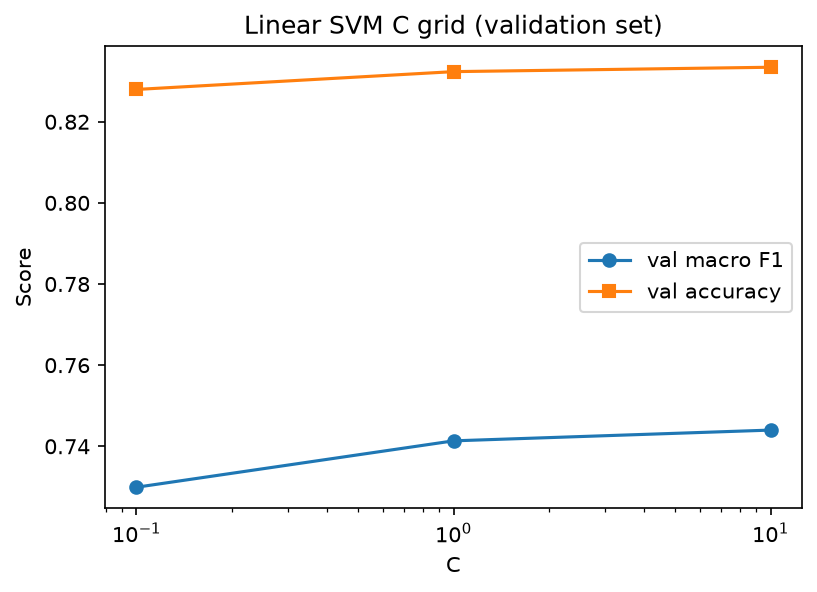
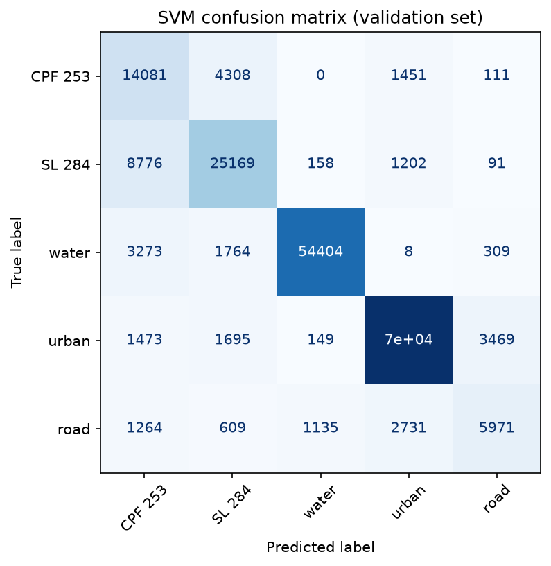
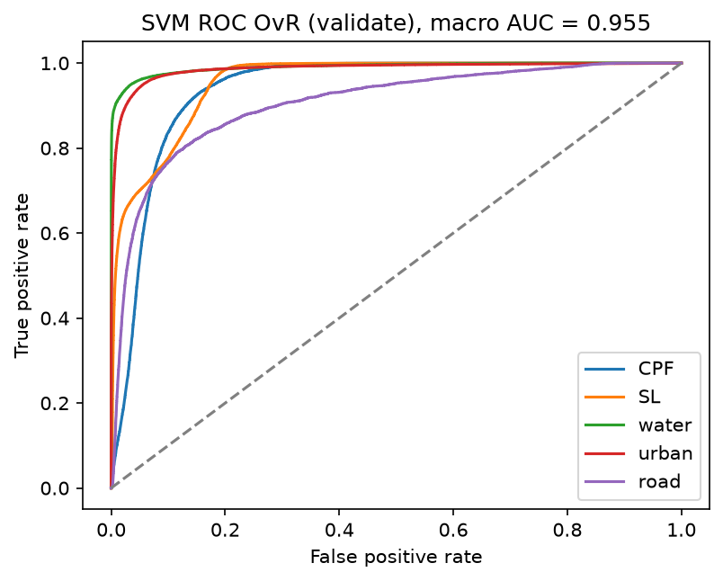
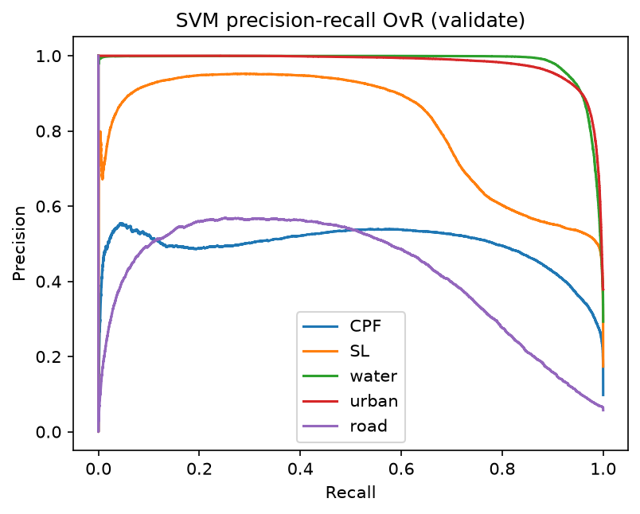
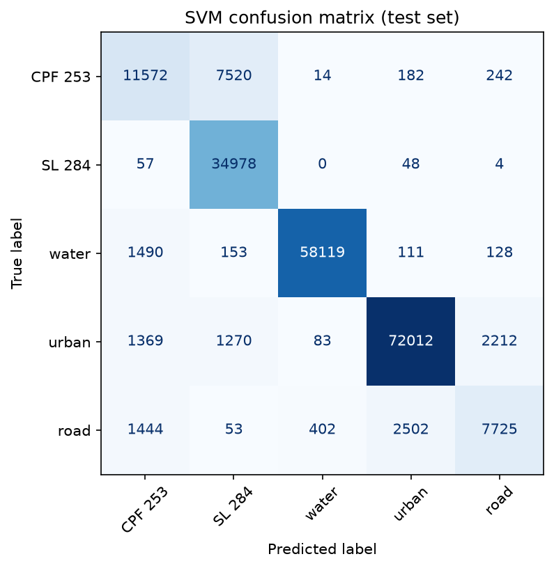
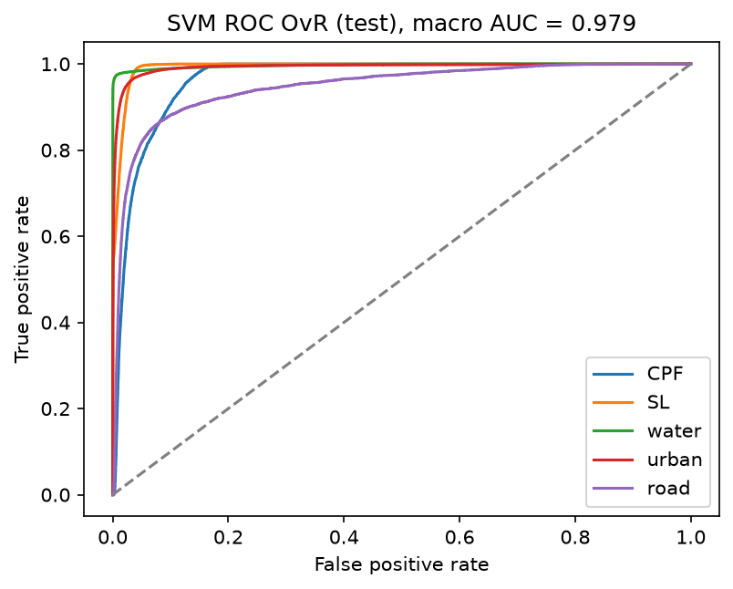
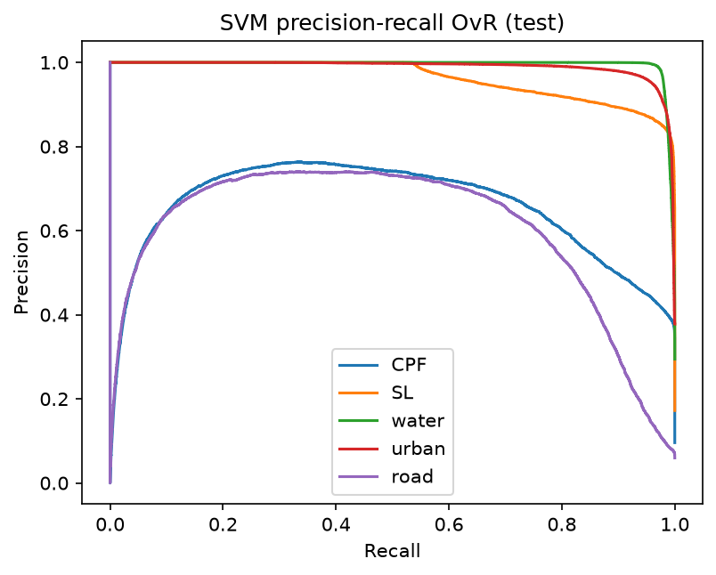
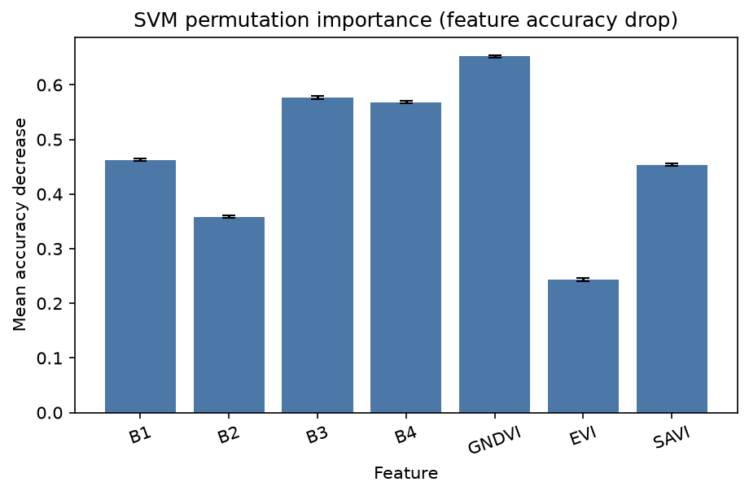

# Linear SVM: 5-class land cover (7 features)

Linear SVM (`LinearSVC`) on the same polygon splits as the CNN.

- Classes: **CPF 253**, **SL 284**, **water**, **urban**, **road**
- Features: `B1, B2, B3, B4, GNDVI, EVI, SAVI` (no lat/lon)
- Split unit: whole polygons
- Kernel: **linear** (`LinearSVC`) — best SVM for this kind of data (see below)
- `class_weight="balanced"` — urban/water were **not** downsampled; the SVM is **not** biased toward large classes
- C chosen on **validate** only (`{0.1, 1, 10}`). Best C = **10.0** (val macro F1 0.7440)
- Test scored **once**

Re-run `python SVM/run_svm.py`. This file is rewritten at the end of that script.

## Why Linear SVM, not RBF

This dataset is **lots of pixels, only 7 features**. Water, vegetation, urban, and road already look different in those bands, so a simple linear split is enough.

RBF is meant for small, messy data where classes twist around each other. Here it would mostly memorize noise inside a field and would not help on new polygons.

Linear SVM is the better match for this data. Leftover mistakes (mainly CPF 253) are unseen fields, not the wrong kernel.

## Headline results

| Split | Accuracy | Balanced acc | Kappa | ROC-AUC (macro OvR) | Macro F1 | Weighted F1 |
|---|---:|---:|---:|---:|---:|---:|
| Validate | 0.8334 | 0.7498 | 0.7731 | 0.9547 | 0.7440 | 0.8387 |
| Test (once) | 0.9053 | 0.8262 | 0.8701 | 0.9789 | 0.8310 | 0.9031 |

## Is the model biased toward large classes?

**No.** Classes have very different pixel counts (urban **495,553**, road **69,203**, about 7.5:1). That does **not** mean the SVM only predicts urban. Large classes were kept in full. Bias is handled with `class_weight="balanced"` (inverse frequency), the same idea as the CNN.

**Problem.** A dummy that always predicts **urban** would get about **37.8%** test accuracy and **0** recall on CPF 253, SL 284, water, and road. This is **not** a dummy dataset. It is a fake always-urban guess on the **real** test pixels (76,946 / 203,690). If the SVM ignored small classes, overall accuracy could still look high because urban + water are ~67% of pixels.

**Solution.** `LinearSVC(..., class_weight="balanced")`. sklearn sets weight `N / (5 × n_c)` so road (smallest) is up-weighted (**4.009**) and urban (largest) is down-weighted (**0.533**). We report balanced accuracy and macro F1, not only overall accuracy. We did **not** downsample urban/water.

**Evidence (this run).** Test accuracy is **0.9053** vs the 37.8% dummy. Balanced accuracy is **0.8262** (not collapsed onto one class). Road test recall is **0.6371** and CPF 253 test recall is **0.5925** — both would be 0 if the model ignored small classes. Water/urban are strong because they are spectrally distinct, not only because they have more pixels.

| Class | Train pixels | Weight `N/(5 n_c)` | Val recall | Test recall |
|---|---:|---:|---:|---:|
| CPF 253 | 93,549 | 1.944 | 0.7058 | 0.5925 |
| SL 284 | 162,026 | 1.123 | 0.7111 | 0.9969 |
| water | 267,055 | 0.681 | 0.9104 | 0.9686 |
| urban | 341,432 | 0.533 | 0.9121 | 0.9359 |
| road | 45,367 | 4.009 | 0.5099 | 0.6371 |

## Data

| Split | CPF 253 | SL 284 | water | urban | road | Total | Share |
|---|---:|---:|---:|---:|---:|---:|---:|
| Train | 93,549 | 162,026 | 267,055 | 341,432 | 45,367 | 909,429 | 69.0% |
| Validate | 19,951 | 35,396 | 59,758 | 77,175 | 11,710 | 203,990 | 15.5% |
| Test | 19,530 | 35,087 | 60,001 | 76,946 | 12,126 | 203,690 | 15.5% |
| **All** | **133,030** | **232,509** | **386,814** | **495,553** | **69,203** | **1,317,109** | **100%** |

`StandardScaler` is fit on **train** only.

## Model

- `sklearn.svm.LinearSVC`
- `class_weight="balanced"`, `dual="auto"`, `max_iter=2000`, seed 42
- C grid on validate:

| C | Val macro F1 | Val acc |
|---:|---:|---:|
| 0.1 | 0.7299 | 0.8280 |
| 1.0 | 0.7413 | 0.8324 |
| 10.0 (best) | 0.7440 | 0.8334 |



ROC uses softmax of `decision_function` (LinearSVC has no `predict_proba`).

## How to run

```
python SVM/run_svm.py
```

## Validate

Accuracy 0.8334. Balanced accuracy 0.7498. Kappa 0.7731. ROC-AUC 0.9547. Macro F1 0.7440. Weighted F1 0.8387.

| Class | Precision | Recall | F1-score | Support |
|---|---:|---:|---:|---:|
| CPF 253 | 0.4878 | 0.7058 | 0.5769 | 19,951 |
| SL 284 | 0.7503 | 0.7111 | 0.7302 | 35,396 |
| water | 0.9742 | 0.9104 | 0.9412 | 59,758 |
| urban | 0.9288 | 0.9121 | 0.9204 | 77,175 |
| road | 0.6000 | 0.5099 | 0.5513 | 11,710 |
| **Overall accuracy** |  |  | **0.8334** | **203,990** |

```
              precision    recall  f1-score   support

         CPF 253     0.4878    0.7058    0.5769     19951
          SL 284     0.7503    0.7111    0.7302     35396
       water     0.9742    0.9104    0.9412     59758
       urban     0.9288    0.9121    0.9204     77175
        road     0.6000    0.5099    0.5513     11710

    accuracy                         0.8334    203990
   macro avg     0.7482    0.7498    0.7440    203990
weighted avg     0.8491    0.8334    0.8387    203990
```

|  | Pred CPF 253 | Pred SL 284 | Pred water | Pred urban | Pred road |
|---|---:|---:|---:|---:|---:|
| Actual CPF 253 | 14,081 | 4,308 | 0 | 1,451 | 111 |
| Actual SL 284 | 8,776 | 25,169 | 158 | 1,202 | 91 |
| Actual water | 3,273 | 1,764 | 54,404 | 8 | 309 |
| Actual urban | 1,473 | 1,695 | 149 | 70,389 | 3,469 |
| Actual road | 1,264 | 609 | 1,135 | 2,731 | 5,971 |







## Test (scored once)

Accuracy 0.9053. Balanced accuracy 0.8262. Kappa 0.8701. ROC-AUC 0.9789. Macro F1 0.8310. Weighted F1 0.9031.

| Class | Precision | Recall | F1-score | Support |
|---|---:|---:|---:|---:|
| CPF 253 | 0.7263 | 0.5925 | 0.6526 | 19,530 |
| SL 284 | 0.7954 | 0.9969 | 0.8848 | 35,087 |
| water | 0.9915 | 0.9686 | 0.9799 | 60,001 |
| urban | 0.9620 | 0.9359 | 0.9488 | 76,946 |
| road | 0.7492 | 0.6371 | 0.6886 | 12,126 |
| **Overall accuracy** |  |  | **0.9053** | **203,690** |

```
              precision    recall  f1-score   support

         CPF 253     0.7263    0.5925    0.6526     19530
          SL 284     0.7954    0.9969    0.8848     35087
       water     0.9915    0.9686    0.9799     60001
       urban     0.9620    0.9359    0.9488     76946
        road     0.7492    0.6371    0.6886     12126

    accuracy                         0.9053    203690
   macro avg     0.8449    0.8262    0.8310    203690
weighted avg     0.9067    0.9053    0.9031    203690
```

|  | Pred CPF 253 | Pred SL 284 | Pred water | Pred urban | Pred road |
|---|---:|---:|---:|---:|---:|
| Actual CPF 253 | 11,572 | 7,520 | 14 | 182 | 242 |
| Actual SL 284 | 57 | 34,978 | 0 | 48 | 4 |
| Actual water | 1,490 | 153 | 58,119 | 111 | 128 |
| Actual urban | 1,369 | 1,270 | 83 | 72,012 | 2,212 |
| Actual road | 1,444 | 53 | 402 | 2,502 | 7,725 |







## Permutation importance

Each feature shuffled on 20,000 validation pixels (10 repeats). **GNDVI** is strongest this run.

| Feature | Mean accuracy drop | Std |
|---|---:|---:|
| GNDVI | 0.6525 | 0.0024 |
| B3 | 0.5766 | 0.0032 |
| B4 | 0.5684 | 0.0028 |
| B1 | 0.4626 | 0.0025 |
| SAVI | 0.4537 | 0.0023 |
| B2 | 0.3585 | 0.0020 |
| EVI | 0.2438 | 0.0027 |



## Files

| Path | What |
|---|---|
| `results/best_model.joblib` | Fitted LinearSVC + scaler |
| `results/metrics.json` | Numeric metrics |
| `results/c_grid.png` | C vs validate scores |
| `results/confusion_matrix_*.png` | 5×5 confusion matrices |
| `results/roc_*.png` / `results/pr_*.png` | OvR curves |
| `results/permutation_importance.png` | Feature importance |
| `SVM_README.md` | This report |
