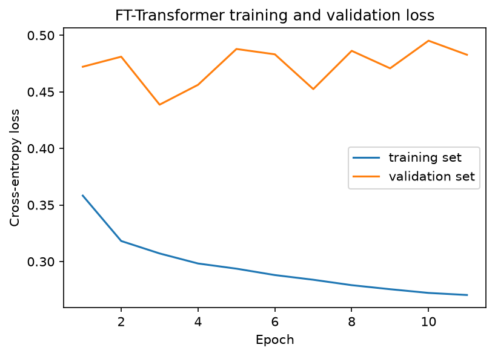
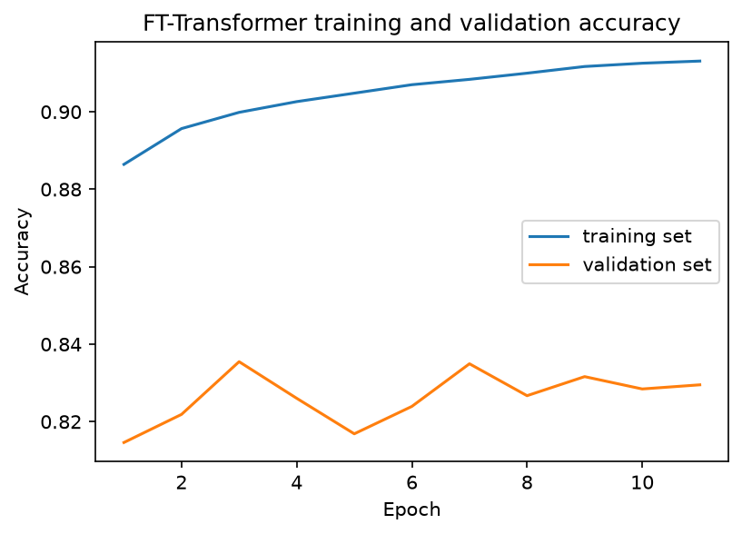
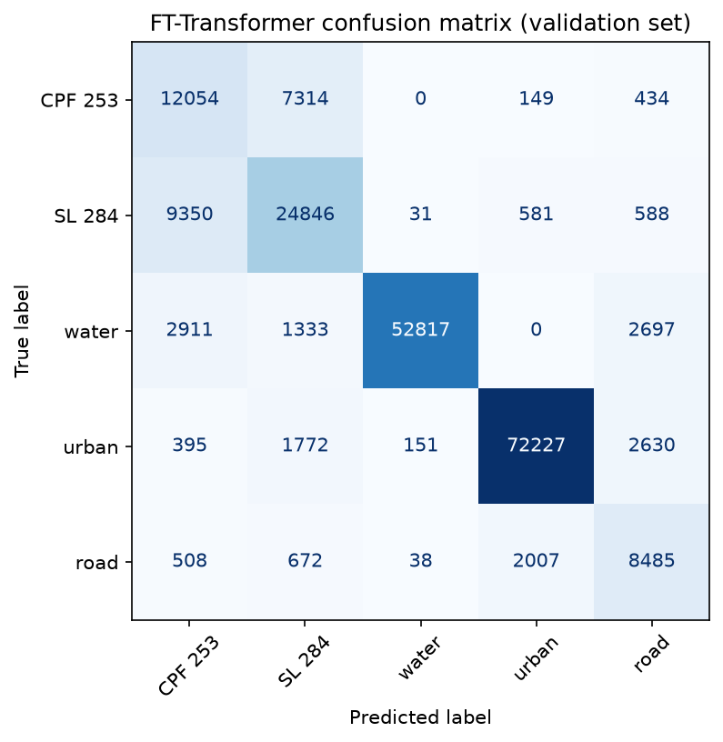
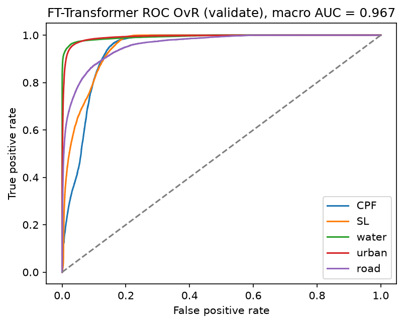
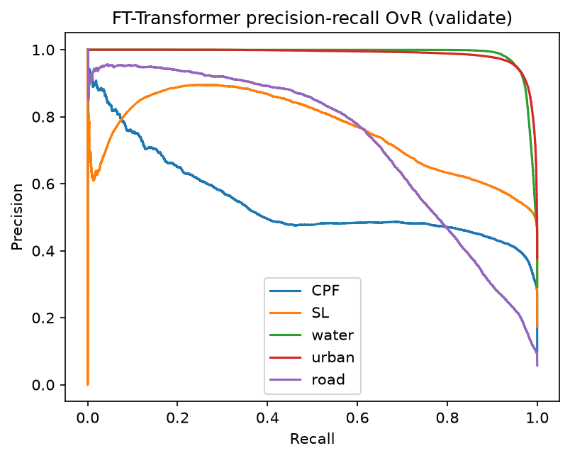
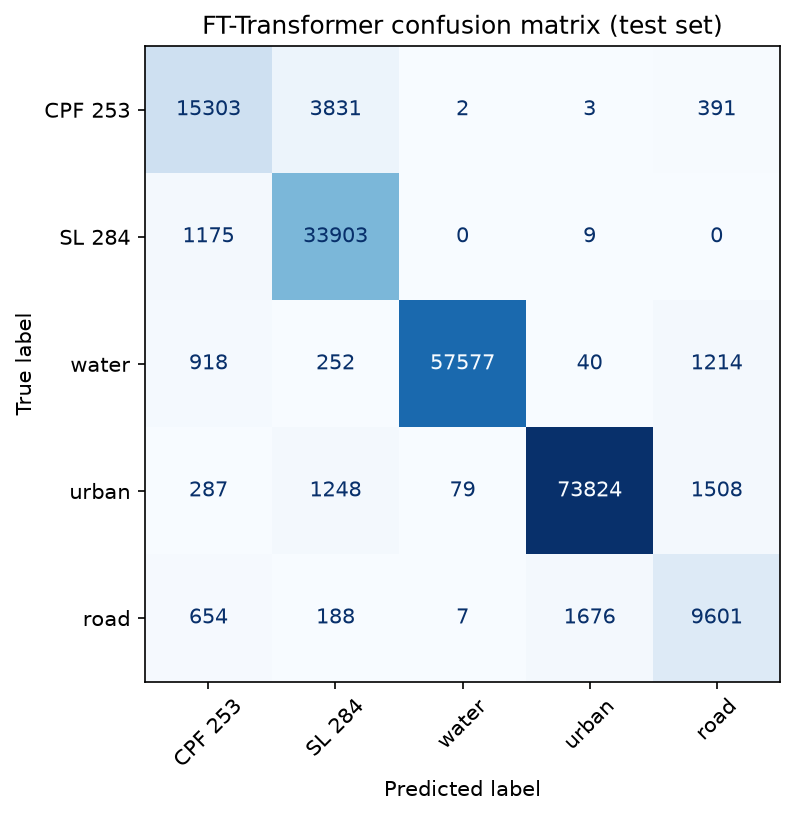
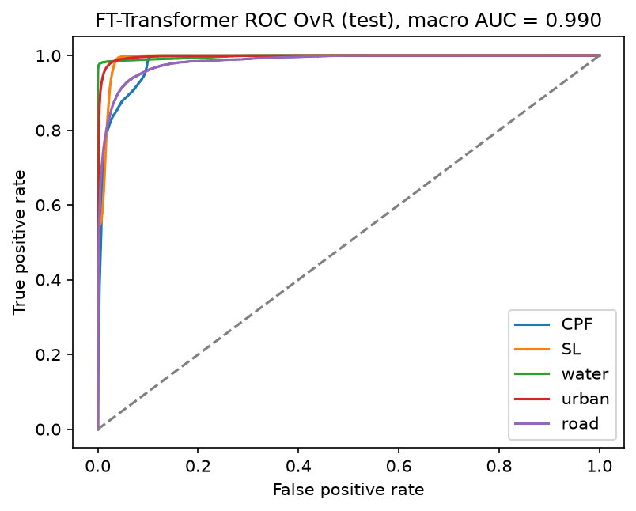
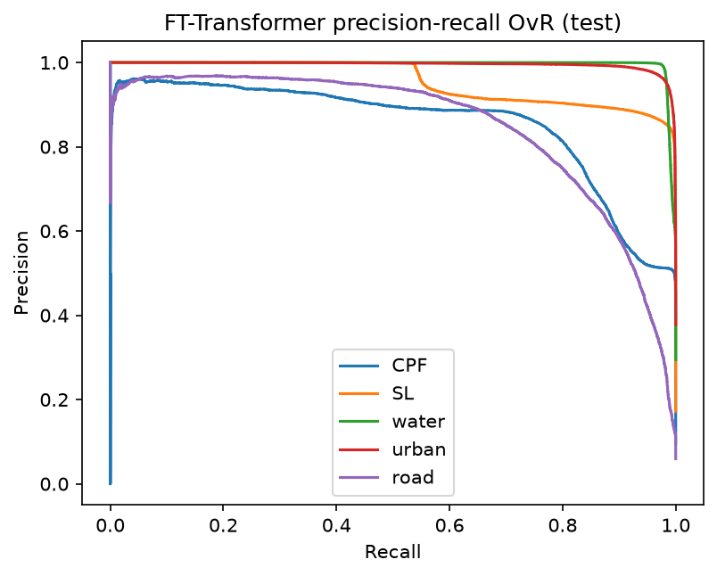
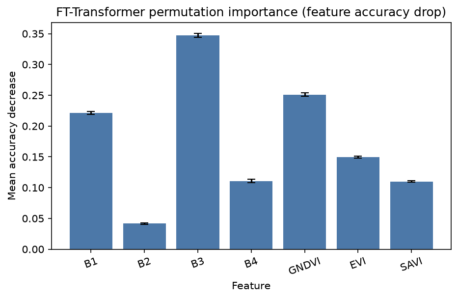

# Tabular-Transformer: 5-class land cover (7 features)

Small tabular transformer (FT-Transformer) on the same polygon splits as the CNN, Linear SVM, and Random Forest.

- Classes: **CPF 253**, **SL 284**, **water**, **urban**, **road**
- Features: `B1, B2, B3, B4, GNDVI, EVI, SAVI` (no lat/lon)
- Split unit: whole polygons
- Inverse-frequency class weights — urban/water were **not** downsampled; the model is **not** biased toward large classes
- Device (this run): `cuda`
- Best checkpoint: epoch 3 (lowest validation loss = 0.4387)
- Test scored **once**

Re-run `python TABULAR_TFRM/run_tfr.py`. This file is rewritten at the end of that script.

## Why Tabular-Transformer

CNN looks at **neighboring** bands. Linear SVM is one straight split. RF mixes features with trees. An FT-Transformer lets **every feature attend to every other** (GNDVI can look at B4) without assuming band order. That is the point of this fourth model. Same full pixels. Same class weights. Still not biased by class size.

This is **not** TabTransformer. That model is for categorical columns. All 7 features here are numeric.

## Headline results

| Split | Accuracy | Balanced acc | Kappa | ROC-AUC (macro OvR) | Macro F1 | Weighted F1 |
|---|---:|---:|---:|---:|---:|---:|
| Validate | 0.8355 | 0.7701 | 0.7771 | 0.9672 | 0.7511 | 0.8433 |
| Test (once) | 0.9338 | 0.8921 | 0.9094 | 0.9904 | 0.8876 | 0.9343 |

## Is the model biased toward large classes?

**No.** Classes have very different pixel counts (urban **495,553**, road **69,203**, about 7.5:1). That does **not** mean the transformer only predicts urban. Large classes were kept in full. Bias is handled in the **loss** with inverse-frequency weights, the same idea as the CNN.

**Problem.** A dummy that always predicts **urban** would get about **37.8%** test accuracy and **0** recall on CPF 253, SL 284, water, and road. This is **not** a dummy dataset. It is a fake always-urban guess on the **real** test pixels (76,946 / 203,690). If the model ignored small classes, overall accuracy could still look high because urban + water are ~67% of pixels.

**Solution.** Weighted cross-entropy with `w_c = N / (5 × n_c)`. Road (smallest) is up-weighted (**4.009**) and urban (largest) is down-weighted (**0.533**). We report balanced accuracy and macro F1, not only overall accuracy. We did **not** downsample urban/water.

**Evidence (this run).** Test accuracy is **0.9338** vs the 37.8% dummy. Balanced accuracy is **0.8921**. Road test recall is **0.7918** and CPF 253 test recall is **0.7836** — both would be 0 if the model ignored small classes.

| Class | Train pixels | Weight `N/(5 n_c)` | Val recall | Test recall |
|---|---:|---:|---:|---:|
| CPF 253 | 93,549 | 1.944 | 0.6042 | 0.7836 |
| SL 284 | 162,026 | 1.123 | 0.7019 | 0.9663 |
| water | 267,055 | 0.681 | 0.8838 | 0.9596 |
| urban | 341,432 | 0.533 | 0.9359 | 0.9594 |
| road | 45,367 | 4.009 | 0.7246 | 0.7918 |

Class weights this run: CPF 253 1.944, SL 284 1.123, water 0.681, urban 0.533, road 4.009.

## Data

| Split | CPF 253 | SL 284 | water | urban | road | Total | Share |
|---|---:|---:|---:|---:|---:|---:|---:|
| Train | 93,549 | 162,026 | 267,055 | 341,432 | 45,367 | 909,429 | 69.0% |
| Validate | 19,951 | 35,396 | 59,758 | 77,175 | 11,710 | 203,990 | 15.5% |
| Test | 19,530 | 35,087 | 60,001 | 76,946 | 12,126 | 203,690 | 15.5% |
| **All** | **133,030** | **232,509** | **386,814** | **495,553** | **69,203** | **1,317,109** | **100%** |

`StandardScaler` is fit on **train** only.

## Model

- Numeric tokenizer: each feature `j` → `x_j * W_j + b_j` in R³²
- Learnable `[CLS]` token (sequence length 8)
- Transformer encoder: 2 layers, `d_model=32`, 4 heads, FFN 64, dropout 0.3
- Head: LayerNorm + Linear(32 → 5)
- Loss: weighted cross-entropy
- Optimizer: Adam (`lr=1e-3`, `weight_decay=1e-4`)
- Batch size 256, max 40 epochs, early stop on validation loss (patience 8), seed 42

## How to run

```
python TABULAR_TFRM/run_tfr.py
```

## Training set vs validation set

Early stop at epoch 11; **best validation loss at epoch 3**.

| Epoch | Train loss | Train acc | Val loss | Val acc |
|---:|---:|---:|---:|---:|
| 1 | 0.3583 | 0.8864 | 0.4722 | 0.8146 |
| 2 | 0.3182 | 0.8957 | 0.4811 | 0.8219 |
| 3 (best) | 0.3071 | 0.8999 | 0.4387 | 0.8355 |
| 4 | 0.2983 | 0.9026 | 0.4562 | 0.8260 |
| 5 | 0.2937 | 0.9048 | 0.4879 | 0.8169 |
| 6 | 0.2880 | 0.9070 | 0.4832 | 0.8239 |
| 7 | 0.2839 | 0.9084 | 0.4524 | 0.8349 |
| 8 | 0.2791 | 0.9100 | 0.4862 | 0.8267 |
| 9 | 0.2755 | 0.9117 | 0.4708 | 0.8316 |
| 10 | 0.2723 | 0.9126 | 0.4952 | 0.8284 |
| 11 | 0.2704 | 0.9131 | 0.4828 | 0.8295 |





## Validate

Accuracy 0.8355. Balanced accuracy 0.7701. Kappa 0.7771. ROC-AUC 0.9672. Macro F1 0.7511. Weighted F1 0.8433.

| Class | Precision | Recall | F1-score | Support |
|---|---:|---:|---:|---:|
| CPF 253 | 0.4780 | 0.6042 | 0.5337 | 19,951 |
| SL 284 | 0.6914 | 0.7019 | 0.6966 | 35,396 |
| water | 0.9959 | 0.8838 | 0.9365 | 59,758 |
| urban | 0.9635 | 0.9359 | 0.9495 | 77,175 |
| road | 0.5720 | 0.7246 | 0.6393 | 11,710 |
| **Overall accuracy** |  |  | **0.8355** | **203,990** |

```
              precision    recall  f1-score   support

         CPF 253     0.4780    0.6042    0.5337     19951
          SL 284     0.6914    0.7019    0.6966     35396
       water     0.9959    0.8838    0.9365     59758
       urban     0.9635    0.9359    0.9495     77175
        road     0.5720    0.7246    0.6393     11710

    accuracy                         0.8355    203990
   macro avg     0.7401    0.7701    0.7511    203990
weighted avg     0.8558    0.8355    0.8433    203990
```

|  | Pred CPF 253 | Pred SL 284 | Pred water | Pred urban | Pred road |
|---|---:|---:|---:|---:|---:|
| Actual CPF 253 | 12,054 | 7,314 | 0 | 149 | 434 |
| Actual SL 284 | 9,350 | 24,846 | 31 | 581 | 588 |
| Actual water | 2,911 | 1,333 | 52,817 | 0 | 2,697 |
| Actual urban | 395 | 1,772 | 151 | 72,227 | 2,630 |
| Actual road | 508 | 672 | 38 | 2,007 | 8,485 |







## Test (scored once)

Accuracy 0.9338. Balanced accuracy 0.8921. Kappa 0.9094. ROC-AUC 0.9904. Macro F1 0.8876. Weighted F1 0.9343.

| Class | Precision | Recall | F1-score | Support |
|---|---:|---:|---:|---:|
| CPF 253 | 0.8345 | 0.7836 | 0.8082 | 19,530 |
| SL 284 | 0.8600 | 0.9663 | 0.9100 | 35,087 |
| water | 0.9985 | 0.9596 | 0.9787 | 60,001 |
| urban | 0.9771 | 0.9594 | 0.9682 | 76,946 |
| road | 0.7552 | 0.7918 | 0.7730 | 12,126 |
| **Overall accuracy** |  |  | **0.9338** | **203,690** |

```
              precision    recall  f1-score   support

         CPF 253     0.8345    0.7836    0.8082     19530
          SL 284     0.8600    0.9663    0.9100     35087
       water     0.9985    0.9596    0.9787     60001
       urban     0.9771    0.9594    0.9682     76946
        road     0.7552    0.7918    0.7730     12126

    accuracy                         0.9338    203690
   macro avg     0.8851    0.8921    0.8876    203690
weighted avg     0.9364    0.9338    0.9343    203690
```

|  | Pred CPF 253 | Pred SL 284 | Pred water | Pred urban | Pred road |
|---|---:|---:|---:|---:|---:|
| Actual CPF 253 | 15,303 | 3,831 | 2 | 3 | 391 |
| Actual SL 284 | 1,175 | 33,903 | 0 | 9 | 0 |
| Actual water | 918 | 252 | 57,577 | 40 | 1,214 |
| Actual urban | 287 | 1,248 | 79 | 73,824 | 1,508 |
| Actual road | 654 | 188 | 7 | 1,676 | 9,601 |







## Permutation importance

Each feature shuffled on 20,000 validation pixels (10 repeats). **B3** is strongest this run.

| Feature | Mean accuracy drop | Std |
|---|---:|---:|
| B3 | 0.3473 | 0.0036 |
| GNDVI | 0.2512 | 0.0032 |
| B1 | 0.2210 | 0.0024 |
| EVI | 0.1492 | 0.0016 |
| B4 | 0.1108 | 0.0027 |
| SAVI | 0.1100 | 0.0012 |
| B2 | 0.0415 | 0.0013 |



## Files

| Path | What |
|---|---|
| `results/best_model.pt` | Weights at best validation loss |
| `results/metrics.json` | Numeric metrics |
| `results/loss_curve.png` / `results/accuracy_curve.png` | Train vs validate |
| `results/confusion_matrix_*.png` | 5×5 confusion matrices |
| `results/roc_*.png` / `results/pr_*.png` | OvR curves |
| `results/permutation_importance.png` | Feature importance |
| `TFR_README.md` | This report |
